  

## About

  

## Selected work

- **[bataille-navale](https://github.com/MaelCompagnon/bataille-navale)** — desktop Battleship in Swing, strict MVC, no frameworks · `Java`

<!-- TODO Maël : ajoute tes autres projets ici, même format. -->
<!-- - **[nom-du-repo](lien)** — une ligne sur ce que ça fait · `Techno` -->

## Route so far

  

## Tech stack

  

## Off-screen

- Weightlifting, running, climbing, volleyball
- Cooking, and fixing things that were arguably not broken
- French, English, German, and enough Finnish to order coffee without incident

## Elsewhere

- [LinkedIn](https://www.linkedin.com/in/ma%C3%ABl-compagnon-157404296)
- compagnonmael@gmail.com

 

<b>Version française</b>

 

**À propos**

- Étudiant en quatrième année d'ingénieur à l'**ESAIP**, spécialité IA
- Opérateur sur cellule robotisée chez **SalMar** en Norvège, après un semestre d'échange en Finlande
- Président d'**ANT** — cours hebdomadaires d'accessibilité numérique pour les séniors
- Développeur web freelance à côté
- **Je cherche un stage de 6 mois pour 2027. N'importe où à l'international.**

**Parcours**

- **2026** · mai–août — **SalMar**, Norvège · opérateur sur cellule robotisée, 22 personnes
- **2026** · janvier–mai — **SeAMK**, Finlande · semestre d'échange
- **2024 →** — **ANT** · président, accessibilité numérique pour les séniors
- **2024** — **Numih** · développement d'une application pour un hôpital
- **ESAIP** — école d'ingénieurs, quatrième année, après deux ans de classe préparatoire
- **Freelance** — sites web pour particuliers

**Hors écran**

- Musculation, course, escalade, volley
- Cuisine, et bricolage sur des objets qui n'étaient pas vraiment cassés
- Français, anglais, allemand, et assez de finnois pour commander un café sans incident

